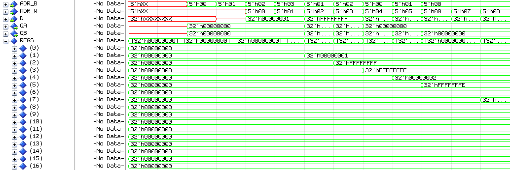
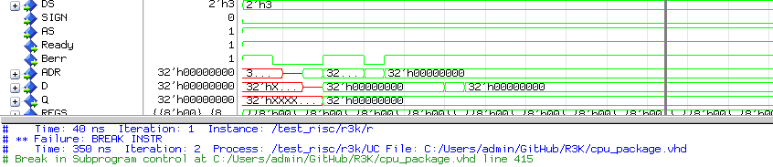
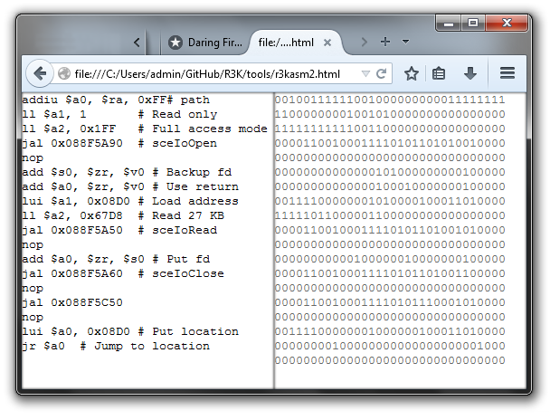
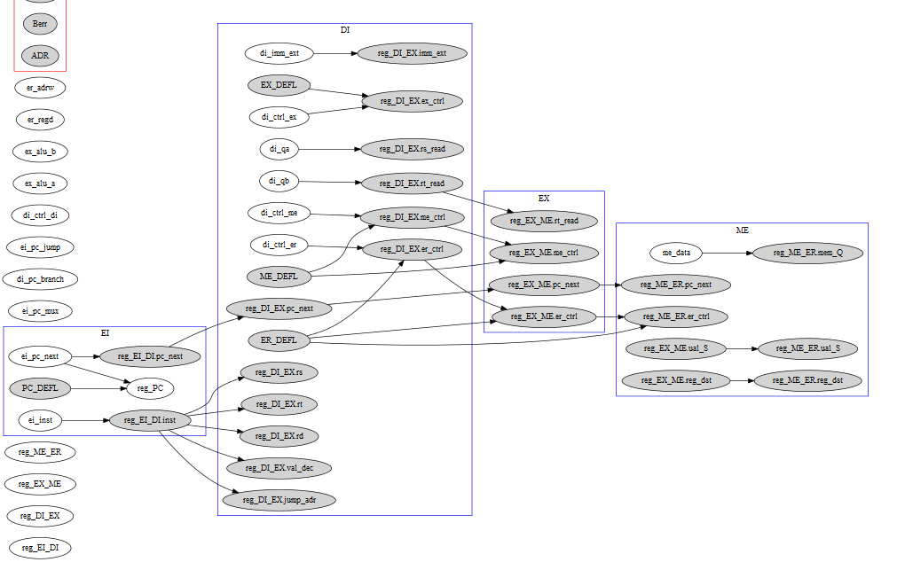

#Introduction :
 
J'ai préféré travailler seul car cela me force à faire le projet de A à Z.
Je n'ai pas essayé de faire le plus vite possible ou le plus de fonction possible.
Je me suis concentré à faire une architecture la plus optimisée possible,
même si cela me force à recommencer (parfois de zéro).
 
Plutôt que de réexpliquer ce que tout le monde a déjà fait dans son projet
(Qu'est-ce qu'un processeur à pipeline, qu'est-ce que le chemin de données, un aléa ...)
j'ai décidé de concentrer mon rapport sur les points qui le différencie des autres.
 
J'ai décidé de répartir la description de mes différents travaux réalisés selon leur emplacement dans le chemin de données.
Après cela, j'ai ajouté les travaux effectués et qui ne sont pas en rapport avec un étage spécifique.
 
# Etage EI
 
Cet étage ne contient que 3 entités (ei_pc_mux, reg_pc, icache).
Leurs rôles se limitent à modifier le PC et à fetcher depuis le cache d'instruction l'instruction pointée par le PC.
 
Le registre PC peut être modifié par plusieurs sources d'adresse :
- Son adresse suivante
- Adresse d'un saut par registre (JR/JALR)
- Adresse d'un saut par valeur immédiate (J/JAL)
- Adresse d'un branchement immédiat/par registre (B*)
 
J'ai décidé d'implémenter ces modifications au plus tôt dans le pipeline.
Les valeurs sont donc disponibles à différents étages dans le pipeline :
- CP+4 : disponible en **EI**
- JR/JALR : disponible en **DI**
- J/JAL : disponible en **DI**
- BNE,BLE... : disponible en **EX**


Il nous faut donc un mux avec plusieurs entrées et plusieurs flags en paramètre et qui prendrait l'adresse la plus avancée parmi toutes celles valides :
 
```VHDL
with(ei_pc_mux) select ei_pc_next <= 
	reg_PC(PC'range)+1 when PC_NEXT, -- "+" surchargé par l'entity adder
	di_pc_branch       when PC_BRANCH,-- BEQ,BNE,BLEZ,BGTZ,BLTZ,BGEZ,BLTZAL,BGEZAL
	ei_pc_jump         when PC_JUMP,  -- J/JAL
	di_qa(PC'range)    when PC_JUMP_R;-- JR/JALR
```

Voici l'agorithme de décision du chemin à emprunter :

```VHDL
ei_pc_mux <= PC_BRANCH when
   ((reg_EX_ME.me_ctrl.BRANCH=B_NE) and (not(reg_EX_ME.ual_Z='1')                                                    ))
or ((reg_EX_ME.me_ctrl.BRANCH=B_EQ) and (   (reg_EX_ME.ual_Z='1')                                                    ))
or ((reg_EX_ME.me_ctrl.BRANCH=B_LE) and (   (reg_EX_ME.ual_Z='1') or     (reg_EX_ME.ual_V='1' xor reg_EX_ME.ual_N='1')))
or ((reg_EX_ME.me_ctrl.BRANCH=B_LT) and (not(reg_EX_ME.ual_Z='1') and    (reg_EX_ME.ual_V='1' xor reg_EX_ME.ual_N='1')))
or ((reg_EX_ME.me_ctrl.BRANCH=B_GT) and (not(reg_EX_ME.ual_Z='1') and not(reg_EX_ME.ual_V='1' xor reg_EX_ME.ual_N='1')))
or ((reg_EX_ME.me_ctrl.BRANCH=B_GE) and (   (reg_EX_ME.ual_Z='1') or  not(reg_EX_ME.ual_V='1' xor reg_EX_ME.ual_N='1')))
else PC_JUMP   when di_ctrl_di.JUMP_IMM
else PC_JUMP_R when di_ctrl_di.JUMP_REG
else PC_NEXT;
```

On remarque que le cas du BRANCH est le plus prioritaire (car disponible tardivement en EX), suivi par les JUMP (disponible en DI) et en dernier le PC+4 si aucune des conditions précédentes n'est remplie.
 
# Etage DI
 
Au fur et à mesure que j'implémentais les différents opcodes de l'unité de control,
j’avais la sensation grandissante que cette unité pouvait être factorisable
en fonction des bits des instructions qu'elle traitait.
Ce sont surtout les instructions SIGNED/UNSIGNED (avec seulement leurs derniers bits qui varient)
qui m'ont mis la puce à l'oreille.
 
Voici donc à quoi ressemble l'unité de contrôle de ma première tentative (180 lignes) :

```VHDL
	DI_ctrl <= DI_DEFL;
	EX_ctrl <= EX_DEFL;
	ME_ctrl <= ME_DEFL;
	ER_ctrl <= ER_DEFL;

	ER_ctrl.REGS_SRCD <= ALU_S;
	ER_ctrl.REGS_W <= '0';

	case OP is 
	when TYPE_R =>
		DI_ctrl.SIGNED_EXT <= '0';
		EX_ctrl.REG_DST<=REG_RD;
		case F is
		
		when JR =>    
			EX_ctrl.ALU_OP  <= ALU_ADD;
			EX_ctrl.BRA_SRC <= "11";
		when JALR =>  
			EX_ctrl.BRA_SRC <= "11";
			ER_ctrl.REGS_SRCD<=NextPC;
		
		when ADD =>   
			EX_ctrl.ALU_OP  <= ALU_ADD;
		when ADDU =>  
			EX_ctrl.ALU_OP  <= ALU_ADD;
			EX_ctrl.ALU_SIGNED <= '0';
		when SUB =>   
			EX_ctrl.ALU_OP  <= ALU_SUB;
		when SUBU =>  
			EX_ctrl.ALU_OP  <= ALU_SUB;
			EX_ctrl.ALU_SIGNED <= '0';
		when iAND =>  
			EX_ctrl.ALU_OP  <= ALU_AND;
		when iOR =>   
			EX_ctrl.ALU_OP  <= ALU_OR;
		when iXOR =>  
			EX_ctrl.ALU_OP  <= ALU_XOR;
		when iNOR =>  
			EX_ctrl.ALU_OP  <= ALU_NOR;
		when LSL =>   
			EX_ctrl.ALU_SRCA<= REGS_QB;
			EX_ctrl.ALU_OP  <= ALU_LSL;
			EX_ctrl.ALU_SRCB<= VAL_DEC;
		when LSR =>   
			EX_ctrl.ALU_SRCA<= REGS_QB;
			EX_ctrl.ALU_OP  <= ALU_LSR;
			EX_ctrl.ALU_SRCB<= VAL_DEC;
		when SLT =>   
			EX_ctrl.ALU_OP  <= ALU_SLT;
		when SLTU =>  
			EX_ctrl.ALU_OP  <= ALU_SLT;
			EX_ctrl.ALU_SIGNED <= '0';
		when others =>
		end case;
	when TYPE_B => 
		EX_ctrl.ALU_SRCA<=REGS_QA;
		
		case B is
			when BLTZ =>  
				EX_ctrl.REG_DST<= REG_RD;
				ME_CTRL.BRANCH <= B_LTZ;
				ER_ctrl.REGS_W<='0';
			when BGEZ =>  
				EX_ctrl.REG_DST<= REG_RD;
				ME_CTRL.BRANCH <= B_GEZ;
				ER_ctrl.REGS_W<='0';
			when BLTZAL =>
				EX_ctrl.REG_DST<= R31;
				ME_CTRL.BRANCH <= B_LTZAL;
				ER_ctrl.REGS_SRCD<=NextPC;
			when BGEZAL =>
				EX_ctrl.REG_DST<= R31;
				ME_CTRL.BRANCH <= B_GEZAL;
				ER_ctrl.REGS_SRCD<=NextPC;
			when others =>
		end case;

	when J =>       
		EX_ctrl.BRA_SRC <= "01";
		ER_ctrl.REGS_W<='0';
	when JAL =>     
		EX_ctrl.BRA_SRC <= "01";
		EX_ctrl.REG_DST<= R31;
		ER_ctrl.REGS_SRCD<=NextPC;

	when BEQ =>     
		EX_ctrl.ALU_OP <= ALU_SUB;
		ME_CTRL.BRANCH <= B_EQ;
	when BNE =>     
		EX_ctrl.ALU_OP <= ALU_SUB;
		ME_CTRL.BRANCH <= B_NE;
	when BLEZ =>    
		EX_ctrl.ALU_OP <= ALU_SUB;
		ME_CTRL.BRANCH <= B_LEZ;
		ER_ctrl.REGS_W<='0';
	when BGTZ =>    
		EX_ctrl.ALU_OP <= ALU_SUB;
		ME_CTRL.BRANCH <= B_GTZ;
		ER_ctrl.REGS_W<='0';
	

	when ADDI =>    
		
	when ADDIU =>   
		EX_ctrl.ALU_SIGNED<='0';
	when SLTI =>    
		EX_ctrl.ALU_OP <= ALU_SLT;
	when SLTIU =>   
		EX_ctrl.ALU_OP <= ALU_SLT;
		EX_ctrl.ALU_SIGNED<='0';
	when ANDI =>    
		EX_ctrl.ALU_SIGNED<='0';
	when ORI =>     
		EX_ctrl.ALU_OP <= ALU_OR;
		EX_ctrl.ALU_SIGNED<='0';
	when XORI =>    
		EX_ctrl.ALU_OP <= ALU_XOR;
		DI_ctrl.SIGNED_EXT <= '0';
		EX_ctrl.ALU_SIGNED<='0';
	when LUI =>     
		EX_ctrl.ALU_SRCA<= IMMD;
		EX_ctrl.ALU_OP <= ALU_LSL;
		
		DI_ctrl.SIGNED_EXT <= '0';
		EX_ctrl.ALU_SIGNED<='0';

	when LB =>      
		ME_ctrl.DC_RW<='1';
		ME_ctrl.DC_DS<=MEM_8;
		ME_ctrl.DC_SIGNED<='1';
		ME_ctrl.DC_AS<='1';
		ER_ctrl.REGS_SRCD<=MEM_Q;
	when LBU =>     
		ME_ctrl.DC_RW<='1';
		ME_ctrl.DC_DS<=MEM_8;
		ME_ctrl.DC_SIGNED<='0';
		ME_ctrl.DC_AS<='1';
		ER_ctrl.REGS_SRCD<=MEM_Q;
	when LH =>      
		ME_ctrl.DC_RW<='1';
		ME_ctrl.DC_DS<=MEM_16;
		ME_ctrl.DC_SIGNED<='1';
		ME_ctrl.DC_AS<='1';
		ER_ctrl.REGS_SRCD<=MEM_Q;
	when LHU =>     
		ME_ctrl.DC_RW<='1';
		ME_ctrl.DC_DS<=MEM_16;
		ME_ctrl.DC_SIGNED<='0';
		ME_ctrl.DC_AS<='1';
		ER_ctrl.REGS_SRCD<=MEM_Q;
	when LW =>      
		ME_ctrl.DC_RW<='1';
		ME_ctrl.DC_DS<=MEM_32;
		ME_ctrl.DC_SIGNED<='0';
		ME_ctrl.DC_AS<='1';
		ER_ctrl.REGS_SRCD<=MEM_Q;

	when SB =>      
		EX_ctrl.REG_DST<=REG_RD;
		ME_ctrl.DC_RW<='0';
		ME_ctrl.DC_DS<=MEM_8;
		ME_ctrl.DC_SIGNED<='1';
		ME_ctrl.DC_AS<='1';
		ER_ctrl.REGS_W<='0';
	when SH =>      
		EX_ctrl.REG_DST<=REG_RD;
		ME_ctrl.DC_RW<='0';
		ME_ctrl.DC_DS<=MEM_16;
		ME_ctrl.DC_SIGNED<='1';
		ME_ctrl.DC_AS<='1';
		ER_ctrl.REGS_W<='0';
	when SW =>      
		EX_ctrl.REG_DST<=REG_RD;
		ME_ctrl.DC_RW<='0';
		ME_ctrl.DC_DS<=MEM_32;
		ME_ctrl.DC_SIGNED<='0';
		ME_ctrl.DC_AS<='1';
		ER_ctrl.REGS_W<='0';
	when others =>
	end case;
```

Et voici la version apres réecriture complète en 40 lignes (soit 5 fois plus legère):

```VHDL
di_ctrl_di <= DI_DEFL; -- IMM_UNSIGNED,'0','0'
di_ctrl_ex <= EX_DEFL; -- SUB,ALU_SIGNED,REGS_QA,REGS_QB,REG_RT
di_ctrl_me <= ME_DEFL; -- MEM_32,B_NULL,MEM_READ,MEM_UNSIGNED,'0'
di_ctrl_er <= ER_DEFL; -- REG_WRITE,ALU_S

if(OP=TYPE_R)then                  -- REG ARITHMETIC
	di_ctrl_di.JUMP_REG  <= '1'        when F=JR  or F=JALR;
	di_ctrl_ex.REG_DST   <= REG_RD;-- 
	di_ctrl_ex.ALU_SIGNED<= F(0);-- 1=unsigned
	di_ctrl_ex.ALU_SRCA  <= REGS_QB    when F=LSL or F=LSR;
	di_ctrl_ex.ALU_SRCB  <= VAL_DEC    when F=LSL or F=LSR;
	di_ctrl_er.REGS_SRCD <= NextPC     when F=JR  or F=JALR;
	di_ctrl_er.REGS_WE   <= REG_RDONLY when F=JR;
	di_ctrl_ex.ALU_OP    <= LSR        when F=JR  or F=JALR else F;
	if(f=SYNC)then report "BREAK INSTR" severity FAILURE;end if;
elsif(OP=TYPE_B)then               -- REG BRANCH
	di_ctrl_ex.ALU_SRCB   <= IMM_0;
	with(B) select di_ctrl_me.branch <= 
		B_LT when BLTZ|BLTZAL,B_GE when BGEZ|BGEZAL,B_NULL when others;
elsif OP(5 downto 4) = "10" then   -- MEMOIRE L*/S*
	di_ctrl_ex.REG_DST    <= REG_RD when OP(3)='1' else REG_RT;
	di_ctrl_me.DC_RW      <= OP(3);
	di_ctrl_me.DC_DS      <= OP(1 downto 0);
	di_ctrl_me.DC_SIGNED  <= OP(2);
	di_ctrl_er.REGS_WE    <= OP(3);
elsif OP(5 downto 3) = "001"  then -- IMM ARITHMETIC (REG_RT=REGS_QA <?> IMMD)
	di_ctrl_er.REGS_SRCD  <= ALU_S;
	di_ctrl_ex.ALU_SRCA   <= IMMD   when OP=LUI;
	di_ctrl_ex.ALU_SRCB   <= IMM_16 when OP=LUI else IMMD;
	di_ctrl_ex.ALU_SIGNED <= OP(0);-- 1=unsigned
	di_ctrl_di.SIGNED_EXT <= IMM_SIGNED when OP=ADDI or OP=ADDIU or OP=SLTI;
	di_ctrl_ex.ALU_OP <= OP;
elsif OP(5 downto 2) = "0001" then -- IMM BRANCH (JUMP_BRA = r[rs]<?>r[rt/0])
	with(OP) select di_ctrl_me.branch <=
		B_EQ when BEQ,B_NE when BNE,B_LE when BLEZ,	B_GT when BGTZ,B_NULL when others;
elsif OP(5 downto 1) = "00001" then -- JUMP (J/JAL)
	di_ctrl_di.JUMP_IMM <= '1';
	di_ctrl_er.REGS_WE <= REG_WRITE when OP = JAL else REG_RDONLY;
	di_ctrl_ex.REG_DST <= REG_31    when OP = JAL else REG_RD;
end if;
```

On remarque que :

- Les attributs les plus utilisés par les différents étages sont mis dans la valeur par défaut de l'étage (valeurs qui sont assignées dès le début de la fonction).
Ainsi, même si aucun ALU_OP n'est spécifié (comme dans les étages REG BRANCH_R et IMM BRANCH) c'est l'opération SUB qui sera effectuée (car la plus utilisée par l'ensemble des étages).
- Le choix du code opération de l'ALU est déporté dans l'ALU elle même (dont nous verrons en détail la raison dans le chapitre EX).
- Le code des instructions contient souvent les attributs à certain offset.
Par exemple, pour les instructions de type registre, on a les codes fonctions suivants :

| Name | Code     |
|------|----------|
| ADD  | `10000 0` |
| ADD**U** | `10000 1` |
| SUB  | `10001 0` |
| SUB**U** | `10001 1` |
| SLT  | `10101 0` |
| SLT**U** | `10101 1` |
| LSL  | `00000 0` |
| LSR  | `00001 0` |
| JR   | `00100 0` |
| JALR | `00100 1` |
| iAND | `10010 0` |
| iOR  | `10010 1` |
| iXOR | `10011 0` |
| iNOR | `10011 1` |

On remarque que le bit de poids faible des opérations arithmétiques contient le signe de l'opération (signed/unsigned).
On peut donc simplement écrire  `di_ctrl_ex.ALU_SIGNED<= F(0);` pour mettre l'attribut à la bonne valeur.
 
> Cela signifie que les autres instructions (sauts, opérations booléennes et opérations décalages) auront cet attribut de signe positionné a un étant qui ne leur correspond pas.
> Mais ces derniers ne prennent pas en compte cet attribut donc ce n'est pas un problème
 


Un exemple plus flagrant avec les instructions de type mémoires :
 
| Name | Code     |
|------|----------|
|LB    | `10 0 0 00` |
|LH    | `10 0 0 01` |
|LW    | `10 0 0 11` |
|LBU   | `10 0 1 00` |
|LHU   | `10 0 1 01` |
|SB    | `10 1 0 00` |
|SH    | `10 1 0 01` |
|SW    | `10 1 0 11` |

On remarque que les bits sont de la forme :

| Bits | Description | valeurs |
|----- |-------------|---------|
| 5-4  | toujours | `10` |
| 3    | Type  | `0`=Load, `1`=Store |
| 2    | Signe | `0`=signed, `1`=unsigned |
| 1-0  | Taille| nb d'octets `00`=1, `01`=2, `10`=3, `11`=4 |

Cette unité de contrôle est valide, et le processeur produit bien successivement les valeurs 0,1,-1,-1,2,-2,0 et 8 dans les registres.
 
```
00100000000000000000000000000001;ADDI  r0,0001=> r0
00100000000000010000000000000001;ADDI  r0,0001=> r1
00100000000000101111111111111111;ADDI  r0,FFFF=> r2
00100100000000111111111111111111;ADDIU r0,FFFF=> r3
00000000001000010010011111100000;ADD   r1,r1 => r4
00000000010000100010111111100001;ADDU  r2,r2 => r5
00000000000000000000000000000000;LSL   r0,0  => r0 (NOP)
00000011111000010011100011000000;LSL   r1,4  => r7
00000000000000000000000000000000;NOP
00000000000000000000000000000000;NOP
00000000000000000000000000000000;NOP
00000000000000000000000000001111;SYNC
00000000000000000000000000001000;JR    r0
```


 
Nous pouvons optimiser encore plus et directement envoyer la partie de l'instruction représentant la taille de l'accès mémoire en entrée de notre banc mémoire générique.
C'est ce qui est fait dans la ligne `di_ctrl_me.DC_DS <= OP(1 downto 0)`
 
Il serait possible d'optimiser encore plus l'unité en déportant le switch qui assigne le ALU_OP dans l'alu en créant un `ALU_CTRL` à coté de l'alu et en faisant suivre l'instruction jusqu'à
l'étage de l'ALU (EX) pour que l'ALU_CTRL fasse elle-même le switch pour déterminer l'opération.
 
# Etage EX
 
L'étage EX posede 1 ALU est 3 mux :
 
## MUX : ALU_SRC_A
 
Qui met en entrée A de l'ALU, les signaux :
- QA pour les opérations type registre (excepté LSL/LSR)
- QB pour les opérations LSL/LSR
- IMMD pour les opérations arithmétiques immédiates
 
## MUX : ALU_SRC_B
 
Qui met en entrée B de l'ALU, les signaux :
- QB : pour la plupart des opérations type registre
- IMM : pour toutes les opérations de type arithmétique à valeur immédiate
- VALDEC : pour les instructions LSL et LSR qui contiennent le nombre de décalage dans leur zone "valdec"
- 16 : pour l'instruction LUI qui nécessite un décalage à gauche de 16 bits
- 0 : pour les comparaisons type BNEZ (comparaison "QA vs 0")
 
> Il serait possible de diminuer le nombre d'entrée de ce mux (actuelement de 5)
> en redirigeant le mux vers le signal VALDEC qui contiendrait la valeur constante (0, 16) mise en place par l'unité de contrôle.
> Mais cela sous-entendrait que l'unité de contrôle aurait accès à ces signaux en "out" ce qui n'est pas le cas actuellement,
> et qui serait impossible sans ajouter une grande quantité de fil, alors que notre but est d'en économiser...
 
## MUX : REG_DST
Ce registre est en charge de définir le registre de destination où sera stocké le résultat (qui peut-être soit une lecture mémoire, la sortie de l'ALU, le prochain emplacement du PC)
 
## ALU
 
Comme nous l'avons vue précédemment, le contrôle de l'opération de l'ALU a été déplacé dans l'ALU elle-même.
La raison est simple, cela permet d'éviter 2 switch dans le code de l'unité de contrôle et de les combiner à la place du switch existant dans l'ALU.
L'ALU ne switchera donc plus sur ALU_OP mais sur l'OPCODE ou le FCODE de l'instruction :
 
```VHDL
when iAND|ANDI => tmp_S := A and B;
when iOR |ORI  => tmp_S := A  or B;
when iNOR      => tmp_S := A nor B;
when iXOR|XORI => tmp_S := A xor B;
when LSL |LUI  => tmp_S := shl(A,B);
when LSR       => tmp_S := shr(A,B);
```

> Les instructions type registre `JR` et `JALR` entre respectivement en conflit avec `ADDI` et `ADDIU`.
> Donc à la réception d'un `JR` l'ALU pensera avoir à faire à un `ADDI` or le JR doit faire effectuer un `LSR` à l'ALU.
> La solution est donc de ne pas envoyer le FCODE pour le `JR` et le `JALR` mais directement l'`LSR` :

```
di_ctrl_ex.ALU_OP    <= LSR        when F=JR  or F=JALR else F;
```

# Etage ME
 
Le registre mémoire a été l'une des premières entités sur laquelle j'ai compris qu'il y avait un potentiel d'optimisation.
J'ai donc décidé de la modifier pour qu'elle puisse accepter n'importe quel taille de donnée en entrée en utilisant un `natural` comme attribut du DS.
Puis, dans une seconde itération j'ai décidé de n'utiliser que des `std_logic_vector` car cela permettait de lui mettre en entrée directement les bits des opcodes sans avoir à passer par un `conv_integer`.

```VHDL
P_CACHE: process(CLK, RST, ADR, AS, RW, DS, SIGN) begin
if RST = '0' then 
	REGS <= (others=>(others=>(others=>'0'))) when STRING'(FILENAME)="" else LOAD_FILE(STRING'(FILENAME));
else
	if AS = '0' then
		Q <= (others => 'Z');
	else 
		if (DS/=MEM_8 and ADR(natural(log2(real(conv_integer(DS)+1)))-1 downto 0) /= ZERO)then
			Berr <= '0';
		else
			Berr <= '1';
			if RW = MEM_READ then 
				Q <= (others => '0');
				for i in 0 to conv_integer(DS) loop
					Q((i+1)*8 - 1 downto i*8) <= REGS(conv_integer(ADR(I_ADR'range)))(conv_integer(ADR(B_ADR'range))+i);
				end loop;
				if SIGN = MEM_SIGNED then
					Q(DBUS_WIDTH-1 downto (conv_integer(DS)+1)*8) <= (others=>REGS(conv_integer(ADR(I_ADR'range)))(conv_integer(ADR(B_ADR'range)) + conv_integer(DS))(0));
				end if;
			else -- MEM_WRITE
				if CLK'event and CLK=ACTIVE_FRONT then
					for i in 0 to (conv_integer(DS)) loop
						REGS(conv_integer(ADR(I_ADR'range)))(conv_integer(ADR(B_ADR'range)) + i) <= D((i+1) * 8 - 1 downto i*8);
					end loop;
				end if;
			end if;
		end if;
	end if;
end if;
end process;
```

Cette dernière modification permet à l'entité memory d'obtenir directement la taille à copier à partir du code de l'instruction : `di_ctrl_me.DC_DS <= OP(1 downto 0);`

# Etage ER

L'étage ER ne possède qu'un mux servant a rediriger la source du résultat (REGS_SRCD) vers le banc de registre.
Les différentes sources de résultats sont :
- PC : le prochain PC (utilisé pour stocker dans un registre, le plus souvent le 31, l'adresse de retour de la fonction)
- Q : sortie mémoire (opération de Load)
- S : sortie de l'UAL (la plupart des opérations en général)

```VHDL
er_adrw<=reg_ME_ER.reg_dst;
with(reg_ME_ER.er_ctrl.REGS_SRCD) select er_regd <= 
	reg_ME_ER.mem_Q        when MEM_Q,
	reg_ME_ER.ual_S        when ALU_S,
	conv_std_logic_vector(conv_integer(reg_ME_ER.pc_next), DATA'length)      when NextPC;
end behavior;
```
> Il doit y avoir un meilleur moyen d'arriver a maper deux std_logic_vector de taille différentes
> peut être en utilisant `my_vec & "00"` ?

La sortie du `MUX_SRCD` est stoquée dans la banc de registre indiqué par `REG_W` a condition que `er_reg_w` autoriser l'ecriture dans le bac.

> Une optimisation possible serait de se passer totalement du `er_reg_w` et de laisser toujours l'ecriture possible
> et de pointer `REG_W` vers `R0` lorsque l'on ne veu pas ecrire le resultat dans un registre
> puisque le registre `R0` registre reste a 0 quoi que l'on y ecrive.

# Ajout de l'instruction SYNC
 
Je trouvais frustrant de ne pas avoir de contrôle sur l'arrêt de la simulation autre que le timeout,
j'ai donc décidé d'ajouter une instruction SYNC (famille des instructions TYPE_R, FCODE=001111)
Cette instruction provoque le code VHDL suivant :
 
 
```VHDL
if(f=SYNC)then
    report "BREAK INSTR" severity FAILURE;
end if;
```
 

 
Cela permet de mettre un terme à la simulation proprement (à l'image d'un exit() en C).
 
# IEEE.math_real.log2

J'ai supprimé toute trace de la fonction `cpu_package.log2` au profit de la librairie `IEEE.math_real.log2` car :
- Si ça existe déjà, pourquoi alourdir le code avec des fonctions doublon ?
- elle est surement bien faite (c'est l'IEEE quand même !)

# JS-ASM

Pour m'occuper (et parce-que M Thiebolt nous avais proposé de le faire)
j'ai décidé de créer mon propre assembleur R3000 en me basant sur un de mes anciens projets d'assembleur MIPS.
Le résulta est un assembleur codé en langage web capable de générer du code à la volée (génération en parallèle de la saisie de l'utilisateur)
Sa force réside dans le fait qu'il est syntaxiquement beaucoup moins strict que l'assembleur *r3kasm2* mais il ne gère pas (encore) les labels.



# VHDL 2 GRAPH

Pour m'aider lors de la conception du R3K j'utilisais très souvent le schémas du pipeline fourni par M Thiebolt.
Mais pour vérifier que mon code suivait bien mes dessins, je devais faire de fastidieuses vérifications de code.
J'ai donc décidé de faire un outil capable de régénérer le graphique des étages du pipeline directement à partir du code source `risc.vhd`
Le résultat est assez impressionnant et plus satisfaisant que je ne l'espérais :



# Conclusion
 
Même si je n'ai pas tout fait (cache,envoie,...) je me suis bien amusé sur ce projet.
Cela a été pour moi un excellent exercices qui m'a permis de bien maitriser VHDL
ainsi que l'outil ModelSim qu'on adore détester mais qui au final s'est avéré être un outils extrêmement puissant et personnalisable
